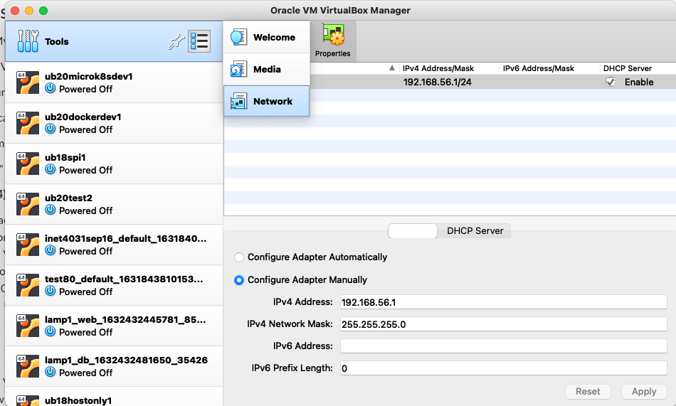
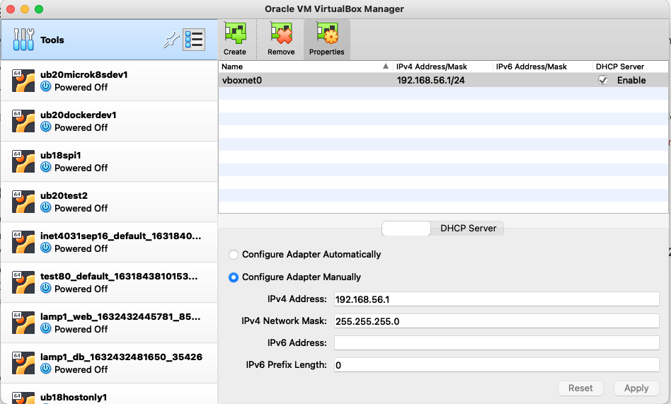
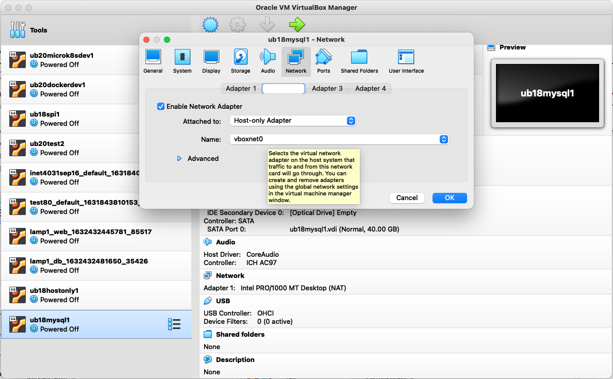

# Manually Installing MySQL
## MySQL Manual Install Steps

### Create a MySQL Database Server on Ubuntu 20.04 using Virtualbox

In this guide we are installing the MySQL database on Ubunt 20.04 running as a VM in Virtualbox.

Common data-driven application architectures implement what are known as CRUD Operations, in which data records can be Created, Retrieved, Updated, and Deleted.

One of the most common means of storing data is in a SQL (Structured Query Language) Database.

In this guide, the "MariaDB" open source distribution of MySQL will be used. 
 

### Ubuntu 20.04 Install & Config

Manually reate a new Virtual Machine with the following configuration: 

- 1024 MB of RAM
- 1 vCPU
- 40GB Hard Disk 

You will need an Ubuntu 20.04 SERVER installer .iso:

Download it here: https://releases.ubuntu.com/focal/

Do not power up the VM yet!

### Virtualbox and Virtual Machine Configuration

Click on the menu in the "Tools" section of the VirtualBox GUI, select "Network", and ensure that you have a "Host Only" network created.  If not click "Create."  Make sure that the "DHCP" box is checked. 

Host Only networks are useful in Virtualbox for ssh access as well as for creating private networks for VM's to talk to one another.

Alter the settings of the VM you created in Step 1, by configuring it to also connect to a Host Only Network.  

Adapter 1 in the VM should be connected to a network named "NAT" and Adapter 2 should be connected to the Host Only network you created in Step 2.  

Adapter 2 will be initially grayed-out.  

Click the "Enable..." box. 

Then select the drop down for Host-only Adapter and the Host Only network.  It will probably be identified as "vboxnet0"  The VM must be powered off to make networking changes!

Boot up the VM!!!

Follow the Ubuntu installer.

The installer will ask if you want to install Open SSH - remember to click yes.

Make sure Ubuntu allocates all of the 40GB hard disk

Wait for everything to finish. Reboot when instructed

 

### Ubuntu Configuration

Login to the VM via the VirtualBox VM console (in other words the VM "window" that displays when the VM is running).

Type in "ip addr" to view the IP addresses on the system. 

The first ethernet adapter, enp0s3, should be connected to the NAT network and should have an ip address of 10.0.2.15.  

The second ethernet adapter, enp0s8 should be the network adapter connected to the Host Only network and should have an IP address in the DHCP range of your Host Only Network.

Write down the IP address associated with enp0s8 - you will use this IP to ssh to the VM.

From a Windows or MacOS command line, type in:  ssh <myusername>@<vmipaddress>
 

### MySQL Installation

Run the following commands in succession to update the server:

    sudo apt update
    sudo apt upgrade

Install the MariaDB distro of MySQL:

    sudo apt install mariadb-server

Check the status:

    sudo systemctl status mariadb

Check the version:

    mysql -V

The "systemctl" command above is used to manage "services" installed on the server.  The MariaDB is installed as a "service."  In other words an application, in this case a database, that will run whenever the server is running.  The command "systemctl status mariadb" should show that the status of the DB is "active (running)".  If not, there was a problem.

If after running the sudo systemctl status mariadb command it seems like you can't get back to the command line, type a CONTROL-C.

Now run a script named mysql_secure_installation to do some preliminary configuration to the MariaDB (MySQL) database.

    mysql_secure_installation

Answer the questions asked using the default suggestions.
    
After running this script, restart MariaDB so the changes take effect.
 
    systemctl restart mariadb

Access the MySQL database by using the "mysql" command.  The MySQL Command Line prompt should be displayed.  Since we don't have any other users built in MySQL yet, we have to login as the superuser.

    sudo mysql

This should appear:

    Welcome to the MariaDB monitor.  Commands end with ; or \g.
    Your MariaDB connection id is 63
    Server version: 10.3.25-MariaDB-0ubuntu0.20.04.1 Ubuntu 20.04

    Copyright (c) 2000, 2018, Oracle, MariaDB Corporation Ab and others.

    Type 'help;' or '\h' for help. Type '\c' to clear the current input statement.

    MariaDB [(none)]> 

In the next steps/commands we will be adding a new user to the database.  We don't want to use the root user all the time. This new user is the one that our future web application will use to access the data in the database tables.

First display the databases that are currently on the server.  These databases hold management data for the server.  Users are stored in the "mysql" database.  We will be adding our new user to a table in the database named "user"

Notice that all MySQL commands require the semicolon terminator at the end of the line.  To input a MySQL command, type in the command, then the semicolon, then hit return.

    MariaDB [(none)]> show databases;

    +--------------------+
    | Database           |
    +--------------------+
    | information_schema |
    | mysql              |
    | performance_schema |
    +--------------------+
    3 rows in set (0.019 sec)
 

Let's see if there are any current users in the "user" table.  The "user" table is in the "mysql" database on the MySQL server.  In the example command below, the dot notation is used:  <databasename>.<tablename>

A "select" statement is used to select only the Host and User columns from the user table (think about a table as an Excel spreadsheet that has many different columns, with many rows of data).   Select statements are of the syntax:    select<column list or * for all columns> from <database table name>

    select Host, User from mysql.user;

#### Create a new user.  Create a user for yourself that has admin privileges.  Descriptions of various MySQL administration commands are easily found on the internet.  Look these commands up so you know what each does.  Remember to replace things in the < > brackets with your own data.

    create user '<yourusername>'@'localhost' identified by '<somepassword>';

The command response to these commands should indicate "Query OK ..."

    grant all privileges on *.* to '<yourusername>'@'localhost';

The "grant" command above is a fairly "broad & sweeping" command that gives your newly created user lots of power.   First it grants ALL privileges.   But to what?  Privileges can be granted by database and by table.  So by saying *.* you are effectively giving your user access to <every database> dot <every table>   Thus why the "*" (star) was used.

***NOTE: Doing the above is BAD BAD BAD.  However this database user is for testing purposes in a development environment.  In production DB's users should only be given access to what they need.***

Repeat the above so that the user can access the database remotely:

    create user '<yourusername>'@'%' identified by '<somepassword>';

    grant all privileges on *.* to '<yourusername>'@'%';

The command response to these commands should indicate "Query OK ..."

For the user changes to take effect, the privilege tables must be "flushed" (love that terminology) and reloaded:

    flush privileges;

You should get a "Query OK..."  If not, you'll get an error.

Now do the "select" statement again to see if your user was created (my example below):

    select Host, User from mysql.user;

    +-----------+-----------+
    | Host      | User      |
    +-----------+-----------+
    | %         | joeaxberg |
    | localhost | joeaxberg |
    | localhost | root      |
    +-----------+-----------+
    3 rows in set (0.003 sec)
 
Log out of the database by typing in:

    quit;

From the Bash shell, test out your new user.  Put -p at the end so it prompts for the password.

    mysql -u <yournew user> -p

Did it work?  

Exit the database (quit;)

##Only Proceed if you Wish, Want, or Need to Upload the Sample Database "Employees"

###Loading the Database with Sample Data

Load the database with some sample data.  A publicly available set of sample data from GitHub will be used.  The sample data is a ficticious 300,000 record employee database.

First make sure you are in your Linux user's home directory:

    cd ~

Download the sample 300,000 record database from GitHub by cloning the project.

    git clone https://github.com/datacharmer/test_db.git

There should now be a test_db directory, change into it.

    joeaxberg@lab23210:~$ ls
    test_db
    joeaxberg@lab23210:~$ cd test_db/
    joeaxberg@lab23210:~/test_db$ 

Note:  if you typed in the command "cd test_db/" by typing every character...you are doing it wrong...  Type in cd, then space, then te, then tab to autocomplete file and directory names.

Inside this directory is the data that is going to be used to load 300,000 sample records into the database.  The data is in the "dump" files.  There is also a file named employees.sql.  Use a command line editor to look at this file for moment.  Can you see what it is doing?  Can you decipher it - even just a little based on what you're seeing?  Like when you see "create table" commands.  What do you suppose a command named "create table" does?

Indeed this file is simply a series of SQL commands.  These commands will be automatically executed by the MySQL command interpreter to create the database, database tables, and load the sample data.  

The format of the command will be:

The mysql command, then specify  -u user and -p password, then add a -t, then add a Linux "redirect" symbol: <  then the employees.sql file.

    mysql -u <yourusername> -p -t < employees.sql

If you have errors, you typed something in wrong.   The Linux redirect "<" indicates to not login to the database and let the user type in commands, but read in the commands from a file.  It is redirecting commands from a file into the user input.

Lots of stuff will scroll by.  It will take a few seconds to complete.

At this point all we're going to do is log back into the database and verify the employees database was created.  We'll be using this data in an upcoming web application.

Login to the database:

    mysql -u <youruser> -p

Now see if the employees database was created:

    show databases;

You should see this:

    +--------------------+
    | Database           |
    +--------------------+
    | employees          |
    | information_schema |
    | mysql              |
    | performance_schema |
    +--------------------+
    4 rows in set (0.004 sec)
    (Inform your instructor if you encounter any issues)

Select the "employees" database:

    MariaDB [(none)]> use employees

    Database changed
    MariaDB [employees]>

Notice that rather than saying "[(none)]", the MySQL Prompt should indicate that the employees database is selected.

Show all the tables in the employees database.

    MariaDB [employees]> show tables;

    +----------------------+
    | Tables_in_employees  |
    +----------------------+
    | current_dept_emp     |
    | departments          |
    | dept_emp             |
    | dept_emp_latest_date |
    | dept_manager         |
    | employees            |
    | salaries             |
    | titles               |
    +----------------------+
    8 rows in set (0.001 sec)

Run a query on the employees table.  First, let's see how many records there are in the employees table by selecting the "count" function.

    MariaDB [employees]> select count(*) from employees;

    +----------+
    | count(*) |
    +----------+
    |   300024 |
    +----------+
    1 row in set (0.001 sec)
    There should be 300,024 rows in the tables.

Use the "describe table" function to see the structure of the table:

    MariaDB [employees]> describe employees;

    +------------+---------------+------+-----+---------+-------+
    | Field      | Type          | Null | Key | Default | Extra |
    +------------+---------------+------+-----+---------+-------+
    | emp_no     | int(11)       | NO   | PRI | NULL    |       |
    | birth_date | date          | NO   |     | NULL    |       |
    | first_name | varchar(14)   | NO   |     | NULL    |       |
    | last_name  | varchar(16)   | NO   |     | NULL    |       |
    | gender     | enum('M','F') | NO   |     | NULL    |       |
    | hire_date  | date          | NO   |     | NULL    |       |
    +------------+---------------+------+-----+---------+-------+
    6 rows in set (0.042 sec)

The output shows the columns in the table.  For example last_name

Employees table includes records with the last name "Tsukuda".      Let search for them:

    MariaDB [employees]> select * from employees where last_name = "Tsukuda";

There should be something like 185 rows.

Now let's search for first and last name;

    MariaDB [employees]> select * from employees where last_name = "Tsukuda" and first_name = "Uinam";

Notice that the select is returning the data in all columns. What if we only wanted to see first name, last name, and hire date?

    MariaDB [employees]> select first_name, last_name, hire_date from employees where last_name = "Tsukuda" and first_name = "Uinam";

    +------------+-----------+------------+
    | first_name | last_name | hire_date  |
    +------------+-----------+------------+
    | Uinam      | Tsukuda   | 1997-02-03 |
    +------------+-----------+------------+
    1 row in set (0.079 sec)

One record/row should be returned. (in SQL a record = row)

Do some research on SQL queries and write a few of your own for practice. (I know you won't, but thought I'd ask...)

Now let's insert a new record into the employees table. In an INSERT statement, first the column names are listed, then their values.

    MariaDB [employees]> insert into employees (emp_no, birth_date, first_name, last_name, gender, hire_date) values (600000, '1969-05-30', 'Joe', 'Axberg', 'M', '2018-03-15');
    Query OK, 1 row affected (0.019 sec)

    MariaDB [employees]>

Then query for it:

    MariaDB [employees]> select * from employees where last_name = "Axberg";

    +--------+------------+------------+-----------+--------+------------+
    | emp_no | birth_date | first_name | last_name | gender | hire_date  |
    +--------+------------+------------+-----------+--------+------------+
    | 600000 | 1969-05-30 | Joe        | Axberg    | M      | 2018-03-15 |
    +--------+------------+------------+-----------+--------+------------+
    1 row in set (0.099 sec)

    MariaDB [employees]> 

Do research and practice SQL queries.  Research how to SELECT, UPDATE, INSERT, and DELETE records.

### Final Stuff

We need modify MySQL to Listen for DB connections both externally and internally.  In its as-delivered state, MySQL will only listen for db connections on localhost (127.0.0.1).  We need to update a configuration file in /etc so that MySQL will listen on the IP address assigned to the Host Only Network. 

    cd /etc/mysql

ls -las  to list the files.  Survey the myriad config files and directories - there are a lot aren't there!

    cd mariadb.conf.d

Edit the 50-server.cnf file using nano, vim, or an editor of your choice.  Remember to use sudo.

Edit the line that says "bind-address"    Change 127.0.0.1 to 0.0.0.0

Save the file and exit (control-o to write, control-x to exit)

Restart MySQL:  

    sudo service restart mysql

### THE END